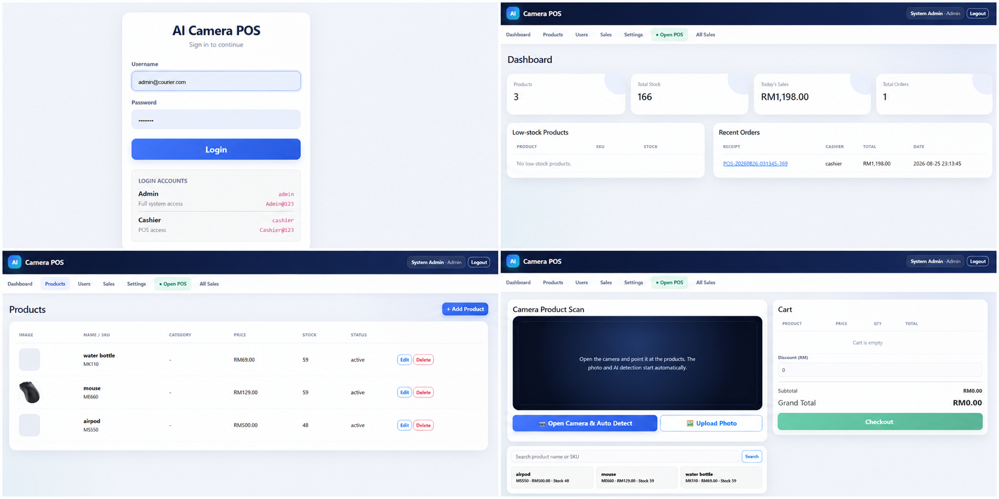

<div align="center">

# 📷 AI Camera POS System

**A mobile-friendly point-of-sale and inventory system powered by Google Gemini**


Identify products with a camera, add trusted catalog items to a POS cart, complete sales, manage stock, and print receipts from one responsive web application.

[Features](#-features) · [Installation](#-installation) · [Demo Accounts](#-demo-accounts) · [Gemini Setup](#-gemini-setup)

</div>

---

## ✨ Features

| Area | Capabilities |
|---|---|
| AI camera | Automatic photo capture, Gemini product detection, quantity recognition, and manual image upload |
| Point of sale | Product search, cart quantities, discounts, payment methods, cash received, and change calculation |
| Product management | Product image, SKU, category, price, stock, and active/inactive status |
| Inventory | Transaction-safe stock deduction, overselling prevention, and low-stock monitoring |
| User management | Admin and Cashier accounts with role-based page access |
| Sales records | Personal Cashier history, complete Admin sales history, receipt details, and printing |
| Gemini fallback | One shared API key, five model slots, selectable active model, and automatic quota fallback |
| Security | Password hashing, CSRF protection, sessions, PDO prepared statements, and verified TLS |

## 🖼️ Screenshots

<p align="center">
  
</p>

<p align="center"><sub><b>Login · Admin Dashboard · Product Management · Camera POS</b></sub></p>

## ✅ Requirements

- XAMPP, or another Apache/PHP/MySQL environment
- PHP 8.0 or newer
- MySQL 5.7+ or MariaDB equivalent
- PHP extensions: PDO MySQL, cURL, Fileinfo, JSON, and OpenSSL
- HTTPS for mobile camera access
- A modern desktop or mobile browser

## 🚀 Installation

1. Place the project in the XAMPP web directory:

   ```text
   C:\xampp\htdocs\ai_system
   ```

2. Start **Apache** and **MySQL** from the XAMPP Control Panel.

3. Configure the database connection in:

   ```text
   config/database.php
   ```

4. Import the database schema with phpMyAdmin:

   ```text
   database.sql
   ```

5. Open the application:

   ```text
   http://localhost/ai_system/
   ```

> Change demonstration passwords before deploying the system publicly.

## 🔑 Demo Accounts

| Role | Username | Password |
|---|---|---|
| Administrator | `admin` | `Admin@123` |
| Cashier | `cashier` | `Cashier@123` |

The SQL installer creates the Administrator account. Create or confirm the Cashier account from **Admin → Users** when required.

## 🤖 Gemini Setup

1. Create a Gemini API key in Google AI Studio.
2. Sign in as Administrator and open **Settings**.
3. Use this official API URL template:

   ```text
   https://generativelanguage.googleapis.com/v1/models/{model}:generateContent
   ```

4. Enter the shared API key once.
5. Configure up to five model IDs and select the current active model.
6. Save and click **Test AI Fallback**.

If the active model reaches its quota or rate limit, the system automatically tries the next configured model.

## 👥 User Roles

### Administrator

- View dashboard totals and recent orders
- Manage users, products, prices, images, and stock
- Review all completed sales and receipts
- Configure the Gemini API, models, and fallback order
- Open the POS when required

### Cashier

- Open the camera POS
- Automatically capture and detect products
- Upload product photos or search manually
- Edit cart quantities and complete checkout
- Print receipts and review personal sales history

## 📱 POS Workflow

```text
Login
  ↓
Open POS
  ↓
Open Camera or Upload Photo
  ↓
Automatic AI Detection
  ↓
Confirm Cart and Quantity
  ↓
Select Payment and Checkout
  ↓
Print Receipt
```

Gemini identifies only catalog products and quantities. Product names, SKUs, prices, and stock values are always retrieved from MySQL.

## 📁 Project Structure

```text
ai_system/
├── admin/               # Dashboard, products, users, sales, and settings
├── api/                 # Detection, checkout, search, and AI connection test
├── assets/              # Shared CSS and JavaScript
├── cashier/             # POS, personal sales history, and receipts
├── config/              # Database configuration
├── includes/            # Security, layout, database, and Gemini helpers
├── uploads/products/    # Uploaded product images
├── database.sql         # MySQL schema and initial data
├── login.php            # User authentication
└── README.md            # Project documentation
```

## 🔐 Deployment Notes

- Use HTTPS for production login, mobile camera access, and checkout.
- Keep database credentials and Gemini API keys out of Git.
- Make `uploads/products/` writable by the web server.
- Disable PHP `display_errors` and enable private error logging.
- Test the camera, Gemini connection, checkout, stock deduction, and receipt printing on the actual hosting environment.
- Back up the database regularly.

## 📄 License

This project is provided for learning and small-shop customization. Add the license that matches your intended distribution before publishing it publicly.

---

<div align="center">
  <sub>Built for fast product scanning, simple sales, and reliable inventory control.</sub>
</div>
